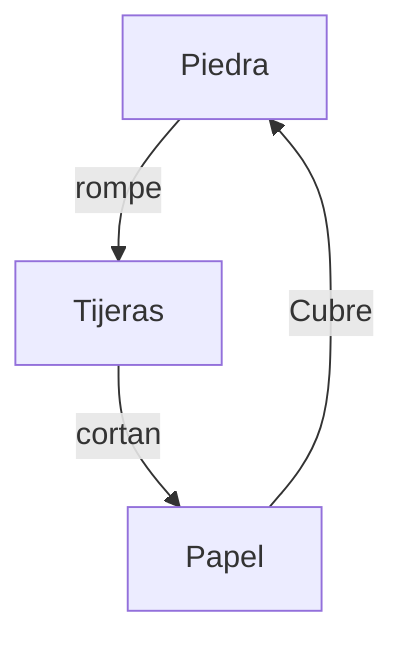

![[Pasted image 20250917171927.png|450]]

>[!important] Balancear un juego es **ajustar los elementos del juego hasta que otorguen la experiencia que quiero (o el diseñador de juegos)**.

Se dice que balancear un juego es una ciencia, pero está lejos de ello, en realidad es más una actividad artesanal dado que es entender los sutiles detalles en las relaciones entre los [[5. El Juego Consiste en Elementos|elementos]] del juego y **cuáles alterar, cuánto alterarlos y cuáles dejar en paz**.

Como una receta, una cosa es determinar los ingredientes necesarios, pero otra es decidir cuánto usar de cada uno y cómo deben ser combinados. Algunas decisiones serán basadas en matemáticas puras, otras en gusto personal.

El balance de juegos puede venir en una variedad de formas, porque cada juego diferente tiene diferentes cosas que deben ser balanceados. Sin embargo, existen ya algunos patrones de balanceo recurrentes.
# Los 12 tipos comunes de balanceo de juego

## 1. Juego Justo

> No hay diversión en una batalla desigual. - Mrs. Cavour
### Juegos simétricos

Un juego simétrico es cuando **a todos los jugadores se les da los mismos recursos y poderes**, esto para que el juego se sienta **justo**. Es un buen sistema para descubrir buenos jugadores ya que los juegos se basarán en la [[Mecánica, Habilidad|habilidad]]. También, pese a que a se intentan hacer juegos perfectamente simétricos, es imposible, ya que siempre estará la cuestión de qué jugador comenzará, lo que inevitablemente dará una ventaja. Esto se resuelve con el azar o bien dejando que el jugador novato comience.
### Juegos asimétricos

A veces es deseable darle a los jugadores recursos y habilidades diferentes a cada uno, pero implica un balanceo significativo.

Algunas razones por las que quisiera hacer un juego asimétrico son:

1. **Simular una situación del mundo real**
	1. Como en la [[2da Guerra Mundial]], las fuerzas del [[Axis]] y la [[Alianza]] tenían recursos y habilidades diferentes.
2. **Para darles a los jugadores una nueva manera de explorar el [[Espacio de juego]]**
	1. La [[Exploración]] es uno de los mayores placeres en un [[Gameplay]]. 
	2. Los jugadores disfrutan explorar las **posibilidades de jugar el mismo juego con diferentes poderes y recursos**.
		1. Como los juegos de pelea, donde hay varios tipos de luchadores únicos, convertimos un simple juego de peleas en varios juegos por la permutación que se logra.
3. **Personalización**
	1. Darle poder a los jugadores para escoger sus propios poderes y habilidades que mejor se acoplen a sus *verdaderas* habilidades, **haciendo sentir al jugador poderoso**, moldeando el juego a sus propias habilidades.
4. **Para nivelar el terreno de juego**
	1. Los jugadores tienen niveles radicalmente diferentes de habilidad.
	2. Es importante también balancear el juego para la computadora hablando de videojuegos.
	3. Apoyar al jugador permite nivelar el juego para todos.
5. **Para crear situaciones interesantes**
	1. Hay más Espacios de juego asimétricos que simétricos.
	2. Los jugadores tienden a ser [[Lente 6, El lente de la Curiosidad|curiosos]] sobre qué lado tiene más ventaja.

Es difícil ajustar apropiadamente los recursos y poderes en un juego asimétrico para hacerlos sentir balanceados. El método más común es **asignar un valor a cada recurso o poder y asegurarse de que la suma de sus valores sea igual para ambos lados**:
#### Batalla biplano

Imagina un juego de combate aéreo entre biplanos. Cada jugador puede elegir uno de los siguientes aviones:

![[Pasted image 20250917182725.png]]

¿Están igualmente balanceados estos aviones? Si les ponemos valores a los atributos tenemos esto:

![[Pasted image 20250917183321.png]]

Al verlo así se nota que está mal balanceado, haciendo del Sopwith Camel menos atractivo para jugar, aunque la Piranha y el Revenger, pese a tener valores de balanceo casi iguales, puede que se *sientan* balanceados. Por ello podemos especular que el Firepower es más doblemente más valioso, y si lo ajustamos a nuestra tabla tenemos:

![[Pasted image 20250917183610.png]]

Si cambiamos el Firepower a High (6), tendremos los aviones totalmente balanceados:

![[Pasted image 20250917184429.png]]

Pero hay que tener cuidado dado que *en teoría* está balanceado, pero en **práctica**, por lo que es importante hacer [[Playtesting]] para ver cómo se siente el juego, y si aún así se siente desbalanceado habrá que hacer cambios.

>[!tip] El acto de balancear y desarrollar un modelo de cómo balancear van de la mano.

Balancear un juego comienza realmente cuando el juego es jugable.
#### Piedra, papel o tijeras

Una manera de balancear un juego también es que, si hay un elemento que tiene una ventaja por encima de otro elemento, ¡podemos hacer un elemento que tenga una ventaja por encima de éste! Esto se conoce como
##### Balance circular

Uno de los juegos que implementan el Balance Circular es *Piedra, papel o tijeras*.:

- La piedra rompe las tijeras
- Las tijeras cortan el papel
- El papel cubre la piedra

>[!important] Balancear un juego **para que se sienta justo** es el tipo de balanceo fundamental.
>
# [[37, El Lente del Juego Justo]]
## 2. Reto vs. Éxito

Relacionado con [[10. La Experiencia Está en la Mente del Jugador]]:

![[Pasted image 20250917192002.png]]

Es deseable que el [[Jugador]] se mantenga en el [[Lente 21, El lente del Flujo|flujo]]. Algunas de las técnicas para mantener este baile de flujo son:

- **Incrementar la dificultad tras cada éxito**
	- Cada nivel es más difícil.
		- No olvidar usar el patrón de **tensión y descanso**.
- **Hacer que los jugadores pasen las partes más fáciles rápidamente**
	- Para los jugadores con habilidad, es mejor darles un descanso al pasar por niveles fáciles rápidamente. En cambio, para los jugadores con menos habilidad estos niveles pueden ser retos.
- **Crear "capas de [[Desafíos]]"**
	- Es como "calificar" al jugador en base a su desempeño. Esto permite [[11. La Mente del Jugador Es Impulsada por la Motivación del Jugador|motivación]] para que el jugador siga mejorándose a sí mismo y poco a poco tener una calificación que le permita avanzar al siguiente nivel.
- **Permitirle al jugador seleccionar la dificultad**.
- **Hacer [[Playtesting]] con jugadores diversos**.
	- Entre novatos y expertos.
- **Darle a los perdedores un descanso**
	- Mario Kart por ejemplo, con sus Power-Ups, hace que los que estén en los primeros lugares tengan Power-Ups más débiles que los que están atrás. Esto es un gran balance para un juego justo.

